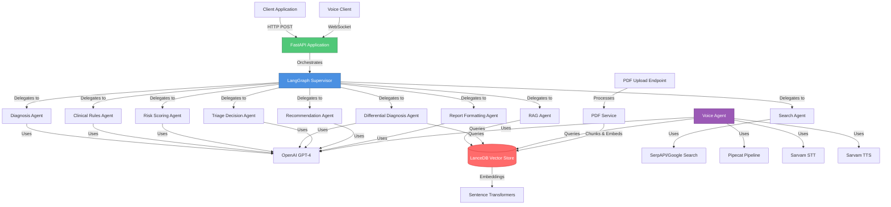
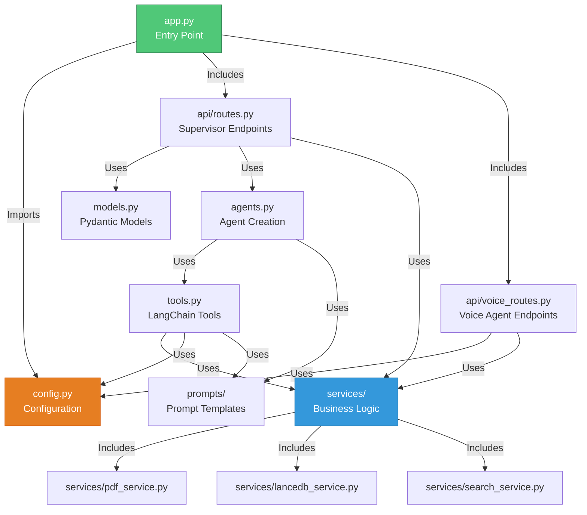
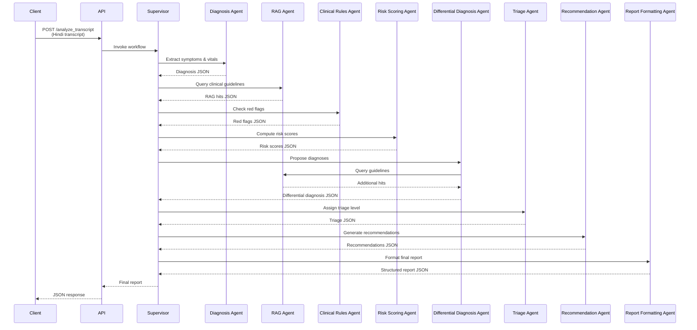
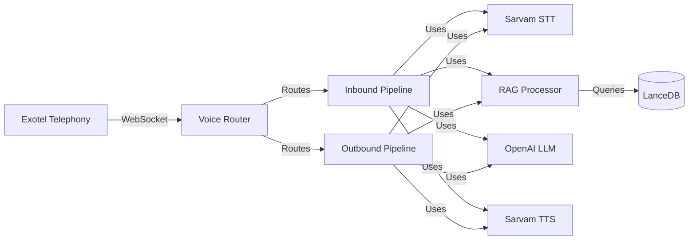
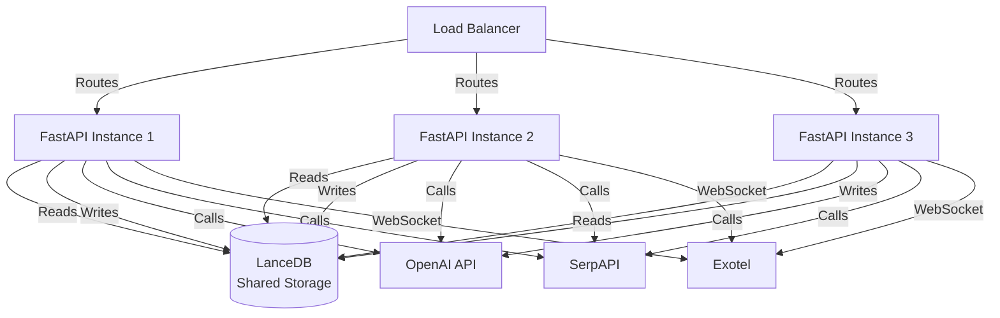

# SwasthyaAI Architecture Documentation

## System Architecture Overview

SwasthyaAI uses a **hierarchical multi-agent architecture** with a central supervisor orchestrating specialized clinical agents. The system is built on FastAPI and uses LangGraph for agent coordination. The codebase follows a modular architecture with clear separation of concerns.

## High-Level Architecture



## Module Architecture

The codebase is organized into modular components following Python best practices:



## Component Details

### 1. Application Entry Point (`app.py`)

The main FastAPI application file is now a clean entry point (45 lines) that:
- Initializes the FastAPI app
- Includes API routers
- Registers WebSocket endpoints

**Structure:**
```python
app = FastAPI(...)
app.include_router(router)  # Supervisor orchestrator routes
app.include_router(voice_router)  # Voice agent routes
```

### 2. Configuration Management (`config.py`)

Centralized configuration using a `Settings` class:
- Environment variables
- API keys and credentials
- Model configurations
- Service settings (PDF, RAG, Voice Agent)
- Lazy-loaded resources (embedding model)

**Benefits:**
- Single source of truth for configuration
- Type-safe settings
- Validation at startup
- Easy to test and mock

### 3. Data Models (`models.py`)

Pydantic models for request/response validation:
- `TranscriptRequest`: Transcript analysis request
- `PDFUploadResponse`: PDF upload response

### 4. Services Layer (`services/`)

Business logic separated into service classes:

#### PDF Service (`services/pdf_service.py`)
- Text extraction from PDFs
- Text chunking with overlap
- Embedding generation

#### LanceDB Service (`services/lancedb_service.py`)
- Vector database operations
- Embedding storage
- Similarity search

#### Search Service (`services/search_service.py`)
- Health news search via SerpAPI
- Query formatting
- Result processing

### 5. Tools Module (`tools.py`)

All LangChain tools organized in one module:
- Helper functions for common operations
- Consistent error handling
- JSON parsing utilities
- OpenAI API wrapper

### 6. Agents Module (`agents.py`)

Agent creation and supervisor workflow:
- Factory function for all agents
- Supervisor workflow compilation
- Centralized agent configuration

### 7. API Routes

#### Supervisor Routes (`api/routes.py`)
- `POST /analyze_transcript`: Main analysis endpoint
- `POST /upload_pdf`: PDF upload for RAG

#### Voice Agent Routes (`api/voice_routes.py`)
- `WebSocket /ws/exotel/{stream_id}`: Voice agent WebSocket
- `POST /voice/exotel/inbound`: Inbound call webhook
- `POST /voice/exotel/outbound`: Outbound call initiation
- `GET /voice/calls`: List active calls
- `POST /voice/rag/upload-pdf`: RAG PDF upload (voice agent)
- `POST /voice/rag/add-text`: RAG text document upload
- `GET /voice/rag/search`: RAG search

## Agent Workflow



## Voice Agent Architecture

The voice agent uses Pipecat for real-time voice interactions:



**Pipeline Flow:**
1. Audio input → STT (Speech-to-Text)
2. Text → RAG Processor (adds context from knowledge base)
3. Enhanced text → LLM (generates response)
4. LLM output → TTS (Text-to-Speech)
5. Audio output → Exotel → User

## Technology Stack

### Core Framework
- **FastAPI**: Modern Python web framework
- **LangGraph**: Agent orchestration and workflow management
- **LangChain**: LLM integration and tool definitions

### LLM & AI
- **OpenAI GPT-4**: Primary LLM for all agents
- **Sentence Transformers**: Local embedding generation
- **PyTorch**: Deep learning backend for embeddings

### Voice Agent
- **Pipecat**: Real-time voice agent framework
- **Sarvam AI**: STT and TTS services (Hindi support)
- **Exotel**: Telephony platform integration

### Data Storage
- **LanceDB**: Vector database for RAG
- **Pandas**: Data manipulation for LanceDB operations

### External Services
- **SerpAPI**: Google Search integration for health news
- **OpenAI API**: GPT-4 completions

### Utilities
- **PDFPlumber**: PDF text extraction
- **Python-dotenv**: Environment variable management
- **Pydantic**: Data validation
- **Loguru**: Structured logging

## Agent Details

### Core Analysis Agents

#### Diagnosis Agent
- **Tool**: `diagnose_transcript`
- **Input**: Hindi transcript (string)
- **Output**: JSON with symptoms, vitals, medical history, red flags
- **Purpose**: Extract structured medical information from Hindi text

#### RAG Agent
- **Tool**: `query_clinical_guidelines`
- **Input**: Medical keywords (English)
- **Output**: JSON array of relevant guideline snippets
- **Purpose**: Retrieve evidence-based clinical guidelines

#### Search Agent
- **Tool**: `search_health_news`
- **Input**: Search query (Hindi/English)
- **Output**: JSON array of news articles
- **Purpose**: Find recent health news and outbreaks

### Clinical Decision Agents

#### Clinical Rules Agent
- **Tool**: `apply_clinical_rules`
- **Input**: Diagnosis JSON, Symptoms JSON
- **Output**: Red flags array (Hindi), escalation status
- **Purpose**: Detect immediate escalation triggers

#### Risk Scoring Agent
- **Tool**: `compute_risk_scores`
- **Input**: Diagnosis JSON, Symptoms JSON, Age, Comorbidities
- **Output**: Risk scores (sepsis, cardiac, dehydration)
- **Purpose**: Quantify clinical risk

#### Differential Diagnosis Agent
- **Tools**: `differential_diagnosis`, `query_clinical_guidelines`
- **Input**: Symptoms JSON, RAG hits, Clinical context
- **Output**: Diagnoses array with confidence and citations
- **Purpose**: Propose possible diagnoses with evidence

#### Triage Decision Agent
- **Tool**: `assign_triage_level`
- **Input**: Red flags, Risk scores, Differential diagnosis
- **Output**: Triage level, explanation (Hindi), action window
- **Purpose**: Assign urgency level following protocols

### Output Generation Agents

#### Recommendation Agent
- **Tool**: `generate_recommendations`
- **Input**: Diagnosis, Triage, Differential, Risk scores
- **Output**: Patient instructions (Hindi), Doctor actionables (English), Tests, Referrals
- **Purpose**: Generate actionable recommendations

#### Report Formatting Agent
- **Tool**: `format_clinical_report`
- **Input**: All previous agent outputs, Original transcript
- **Output**: Structured JSON report
- **Purpose**: Compile final report in specified format

## Security & Privacy

### Data Handling
- **Pseudo IDs**: Generated for anonymization
- **Consent Status**: Tracked in reports
- **Audit Logs**: All reports include audit trail
- **Local Embeddings**: No data sent to external embedding APIs

### API Security
- **Environment Variables**: Sensitive keys stored in `.env`
- **Input Validation**: Pydantic models for request validation
- **Error Handling**: Graceful error responses without exposing internals

## Scalability Considerations

### Current Architecture
- **Modular Design**: Easy to scale individual components
- **Service Layer**: Business logic separated for independent scaling
- **Single Process**: FastAPI runs in single process
- **Synchronous Agents**: Agents execute sequentially
- **Local Embeddings**: CPU-bound embedding generation

### Future Enhancements
- **Async Agents**: Parallel agent execution
- **Caching**: Cache RAG queries and embeddings
- **Load Balancing**: Multiple FastAPI instances
- **GPU Support**: GPU acceleration for embeddings
- **Database**: Persistent storage for reports and audit logs
- **Message Queue**: For async agent processing

## Monitoring & Observability

### Logging
- FastAPI automatic request logging
- Agent execution traces (via LangGraph)
- Error logging with stack traces
- Structured logging with Loguru

### Metrics (Future)
- Request latency
- Agent execution time
- RAG query performance
- LLM token usage
- Error rates
- Voice call metrics

## Deployment Architecture



## Error Handling

### Agent Failures
- Individual agent failures don't crash the system
- Supervisor can retry or use alternative agents
- Partial results returned when possible

### API Failures
- OpenAI API: Retry with exponential backoff
- SerpAPI: Graceful degradation (optional feature)
- LanceDB: Error messages returned to user
- Voice Agent: Graceful handling of STT/TTS failures

### Validation
- Input validation at API layer (Pydantic)
- JSON parsing errors handled gracefully
- Missing fields populated with defaults

## Code Organization Principles

1. **Separation of Concerns**: Each module has a single responsibility
2. **Dependency Injection**: Services are injected, not hardcoded
3. **Configuration Management**: All settings centralized in `config.py`
4. **Type Safety**: Type hints throughout the codebase
5. **Error Handling**: Consistent error handling patterns
6. **Modularity**: Easy to test, maintain, and extend
